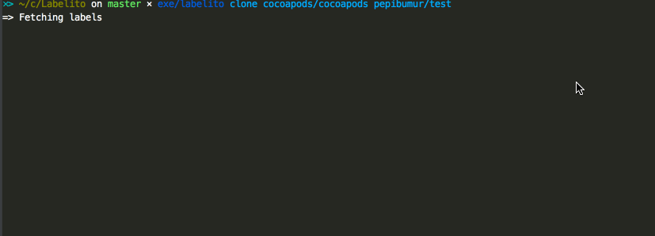

# Labelito

Labelito is a command line tool written in Ruby that automates the label creation on GitHub. It currently supports two ways of creating the labels:

- Cloning them from an existing repository.
- Reading them from a template.

**Example cloning [CocoaPods](https://cocoapods.org) labels**



## Installation

Add this line to your application's Gemfile:

```ruby
gem 'Labelito'
```

And then execute:

    $ bundle

Or install it yourself as:

    $ gem install Labelito

## Usage

```bash
Commands:
  labelito clone FROM_OWNER/FROM_REPO TO_OWNER/TO_REPO  # clone the labels from an existing repository
  labelito create TEMPLATE_PATH REPO_OWNER/REPO         # create labels on a repository based on a template
  labelito help [COMMAND]                               # Describe available commands or one specific command
```

You can specify the GitHub token by:

- Passing a parameter `github_token`
- Defining an environment variable `LABELITO_GITHUB_TOKEN`


## Development

After checking out the repo, run `bin/setup` to install dependencies. Then, run `rake spec` to run the tests. You can also run `bin/console` for an interactive prompt that will allow you to experiment.

To install this gem onto your local machine, run `bundle exec rake install`. To release a new version, update the version number in `version.rb`, and then run `bundle exec rake release`, which will create a git tag for the version, push git commits and tags, and push the `.gem` file to [rubygems.org](https://rubygems.org).

## Contributing

Bug reports and pull requests are welcome on GitHub at https://github.com/carambalabs/Labelito. This project is intended to be a safe, welcoming space for collaboration, and contributors are expected to adhere to the [Contributor Covenant](http://contributor-covenant.org) code of conduct.

## References

- Octokit. Ruby client: [Link](https://github.com/octokit/octokit.rb)
- rspec-mocks: [Link](http://rspec.info/documentation/3.5/rspec-mocks/)
- rspecs-expectations: [Link](http://rspec.info/documentation/3.5/rspec-expectations/)

## License

The gem is available as open source under the terms of the [MIT License](http://opensource.org/licenses/MIT).

